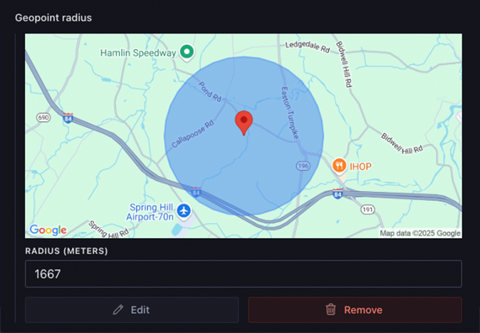

# @sanity/google-maps-input

> For the v2 version, please refer to the [v2-branch](https://github.com/sanity-io/google-maps-input/tree/studio-v2).

## What is it?

Plugin for [Sanity Studio](https://www.sanity.io) providing input handlers for geo-related input types using Google Maps.

This plugin will replace the default `geopoint` input component and adds support for `geopointRadius` fields with circle visualization.


## Known issues in Studio V3

- Diff-preview is not implemented.

These will be re-added well before Studio V3 GA.

## Installation

In your studio folder, run:

```
npm install --save @sanity/google-maps-input
```

or

```
yarn add @sanity/google-maps-input
```

## Usage

Add it as a plugin in sanity.config.ts (or .js), with a valid [Google Maps API key](https://developers.google.com/maps/documentation/javascript/get-api-key):

> [!WARNING]
> This plugin will replace the default `geopoint` input component.

```js
import {googleMapsInput} from '@sanity/google-maps-input'

export default defineConfig({
  // ...
  plugins: [
    googleMapsInput({
      apiKey: 'my-api-key',
    }),
  ],
})
```

Ensure that the key has access to:

- Google Maps JavaScript API (for the interactive map)
- Google Places API Web Service (for the search feature)
- Google Static Maps API (for previewing a location)

And that the key allows web-access from the Studio URL(s) you are using the plugin in.

### Configuration Options

You can also configure additional options:

```js
import {googleMapsInput} from '@sanity/google-maps-input'

export default defineConfig({
  // ...
  plugins: [
    googleMapsInput({
      apiKey: 'my-api-key',
      defaultZoom: 8,
      defaultRadiusZoom: 15, // zoom level for radius editing
      defaultLocation: {lat: 59.91273, lng: 10.74609},
      defaultRadius: 1000, // for geopointRadius fields
    }),
  ],
})
```

### Field Types

#### Basic Geopoint Field


```typescript
// In your schema
export default {
  name: 'location',
  title: 'Location',
  type: 'geopoint',
}
```

#### Geopoint Radius Field



```typescript
// In your schema
export default {
  name: 'serviceArea',
  title: 'Service Area',
  type: 'geopointRadius',
}
```

The `geopointRadius` field type extends the basic geopoint with:

- A radius property (in meters)
- Visual circle overlay on the map
- Editable radius input field
- Draggable circle for radius adjustment
- Enhanced diff visualization showing radius changes

## Stuck? Get help

[](https://slack.sanity.io/)

Join [Sanity’s developer community](https://slack.sanity.io) or ping us [on twitter](https://twitter.com/sanity_io).

## License

MIT-licensed. See LICENSE.

## Develop & test

Add a Google Maps API key to `.env.local` (see `.env.example` for example format).

This plugin uses [@sanity/plugin-kit](https://github.com/sanity-io/plugin-kit)
with default configuration for build & watch scripts.

See [Testing a plugin in Sanity Studio](https://github.com/sanity-io/plugin-kit#testing-a-plugin-in-sanity-studio)
on how to run this plugin with hotreload in the studio.

### Release new version

Run ["CI & Release" workflow](https://github.com/sanity-io/google-maps-input/actions/workflows/main.yml).
Make sure to select the main branch and check "Release new version".
